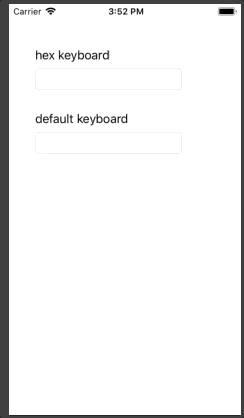

# iOSHexKeyboard

### Description
A small and simple custom iOS keyboard to enter hexadecimal values into an UITextField. 
Written in swift. Tested with iOS 12.1 

### Description
- copy _HexKeyboard.xib_ & _HexKeyboard.swift_ to your project
- attach it to the _UITextView_'s _inputView_ in _viewDidLoad_ (or whereever you think it suites):
```swift
    @IBOutlet weak var inputField: UITextField!
    
    ...

    override func viewDidLoad() {
        super.viewDidLoad()

        ...

        // initialize custom keyboard
        inputField.inputView = HexKeyboard(withInput: inputField)
    }
```
### Preview


### Known issues
- the keyboard layout/size might not be usable on iPad
- might be to tiny on XS/XR-devices